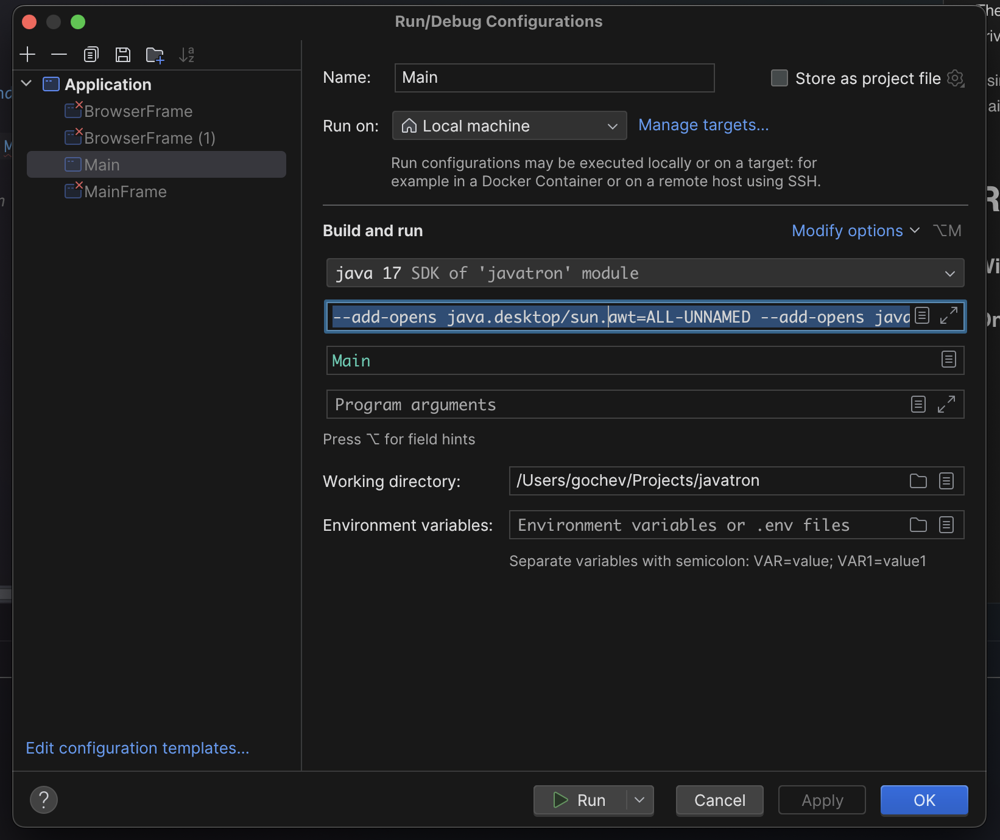
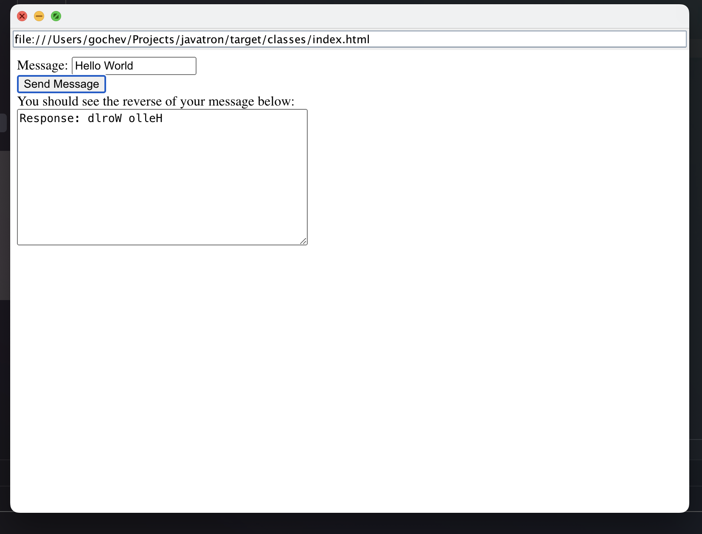
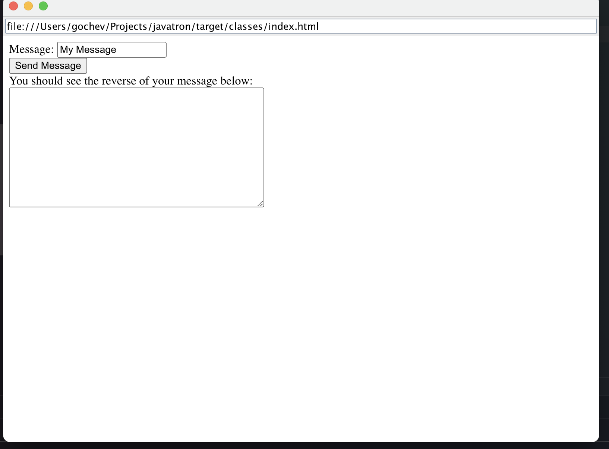

## Javatron e.g. Electron but with Java backend

The idea is to be able to build hybrid apps where the UI is JS/HTML driven and the backend is Java.

Using Chromium Embedded Framework (CEF) to render the UI and plain Java to handle the backend.

# Run

### Windows simply run the Main class

### On MacOS you need to pass `--add-opens java.desktop/sun.awt=ALL-UNNAMED --add-opens java.desktop/sun.lwawt=ALL-UNNAMED --add-opens java.desktop/sun.lwawt.macosx=ALL-UNNAMED`


#Example of the UI



The method invoked on button press is inside the MessageRouterHandler


```java
public class MessageRouterHandler extends CefMessageRouterHandlerAdapter {
    @Override
    public boolean onQuery(CefBrowser browser, CefFrame frame, long query_id, String request, boolean persistent, CefQueryCallback callback) {
        System.out.println("on Query");
        if (request.startsWith("BindingTest:")) {
            // Reverse the message and return it to the JavaScript caller.
            String msg = request.substring(12);
            callback.success(new StringBuilder(msg).reverse().toString());
            return true;
        }
        // Not handled.
        return false;
    }
}
```

